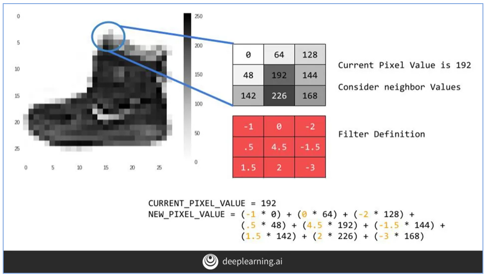

# week3-cnn

- cnn is basically masking in image processing
- pooling (reduce dimensions of the feature maps) → finding the max/average neighbour value on the pixel

- code for CNN with Tensorflow
- more info about the filter (64) → [https://bit.ly/2UGa7uH](https://bit.ly/2UGa7uH)

