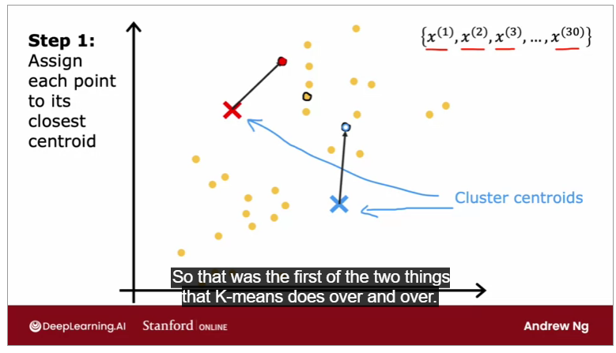
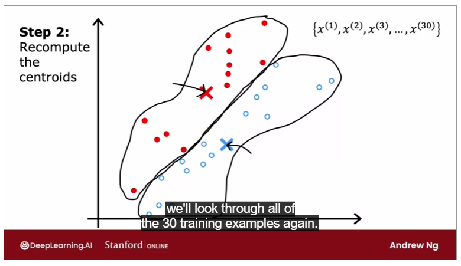
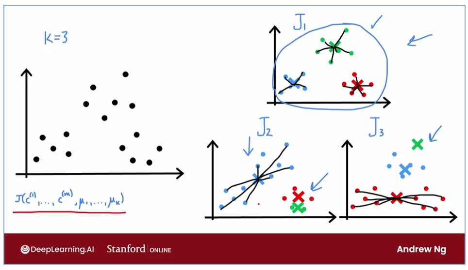
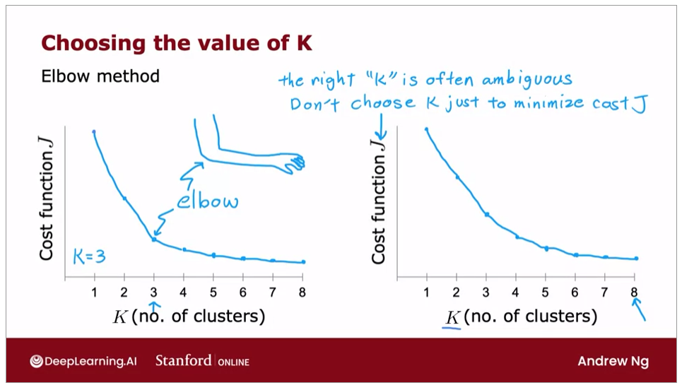
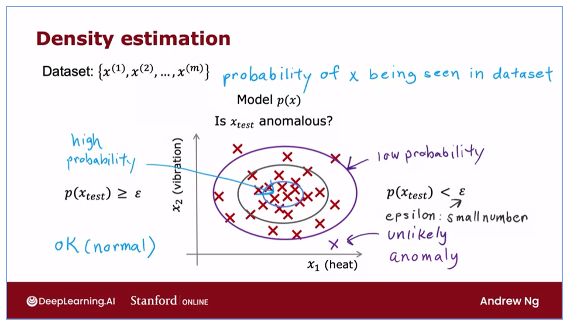
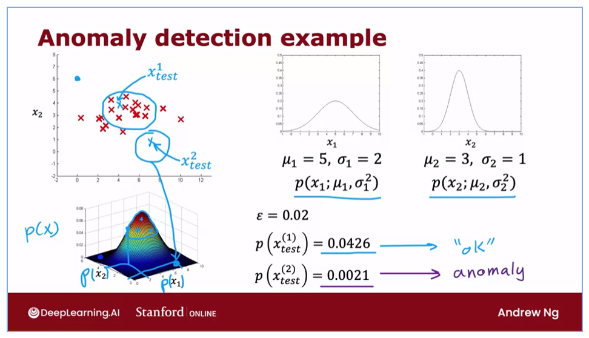
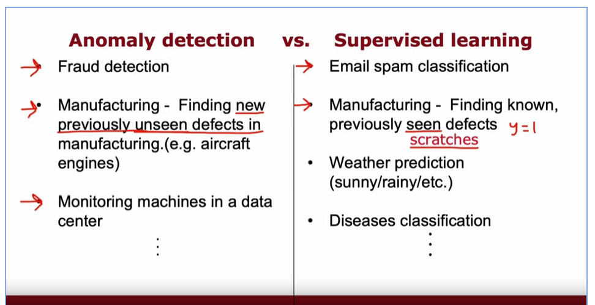
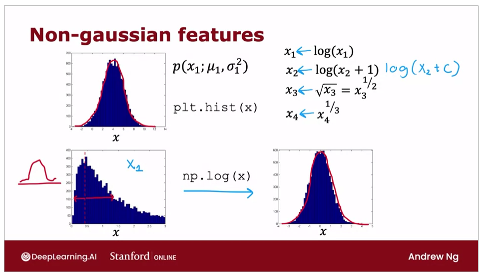

# Unsupervised

- Group the data without the need of label (y)
- Based on the structure (similar news, market segmentation, dna analysis, astronomical data analysis)

## Clustering

### K-Means

- randomly choose two points (cluster centroids)
- go through all X's
- Assign each x to its closest centroid (Step 1)
- After interating through all X's move the centroid to the center of the clustered data (Step 2)
- Repeat Step 1 and Step 2 until there no change of color

figures:

- step 1
  
- step 2
  

- distortion cost function for K-Means

- initializing K-means -> can make different result everytime we initialize a random starting point on clusters. Cost function exist to determine which is the best outcome out of the 3 possible answers.
  

- how to determine the k (number of clusters) -> use the elbow method
  

## Anomaly Detection

- Density Estimation (probability of x being seen in dataset)
  
- Gaussian (normal) distribution
  
- How to determine a good epsilon? -> having an anomalies on the cv and test set can help to evaulate the epsilon
- anomaly (unsupervised) vs supervised
  

- choosing what features to use -> non-gaussian (convert the feature with np.log(x) to make it gaussian (normal))
  
- we can create a new feature to detect anomaly easier
