# Recommender System

## Collaborative Filtering

- Algorithm is very similar to the linear regression
  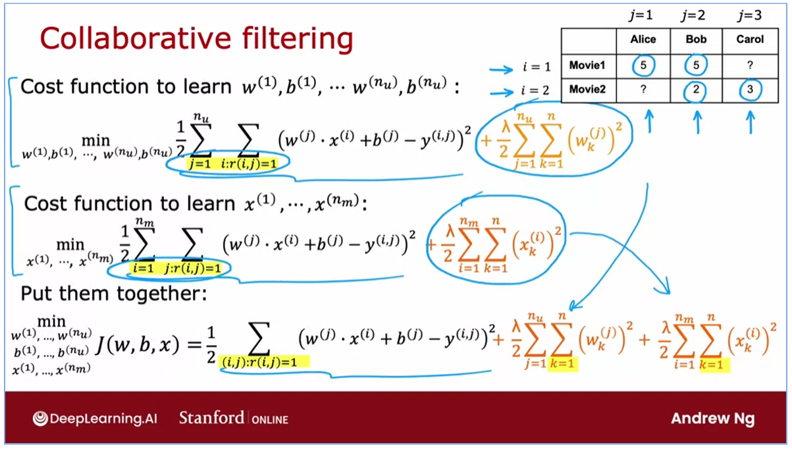
- Collaborative Filtering Problem Motivation -> predict x features
  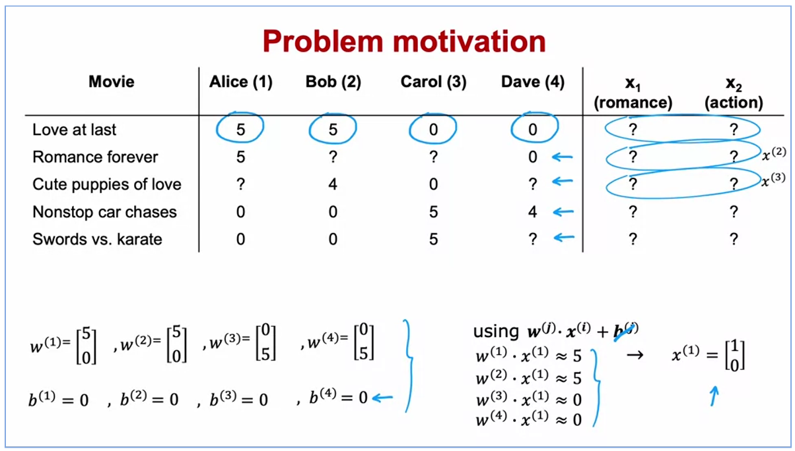
- Gradient Descent of collaborative filtering
  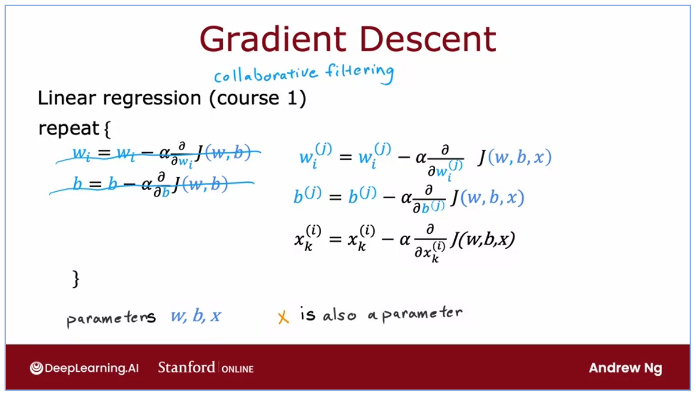
- Example applications (binary classification) -> digital market
  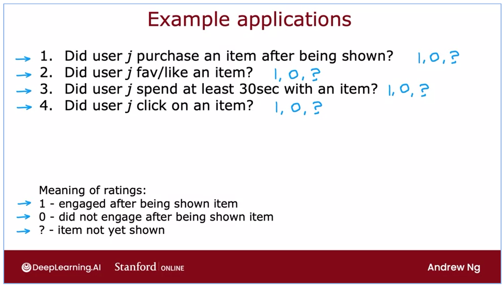

## Recommender Systems Implementation Detail

- Mean normalization helps users that haven't rate any movie (means all ?) to get recommendations
  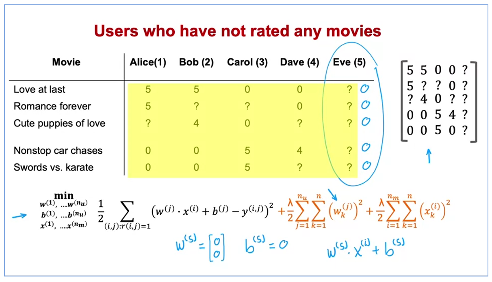
- Calculations mean normalization
  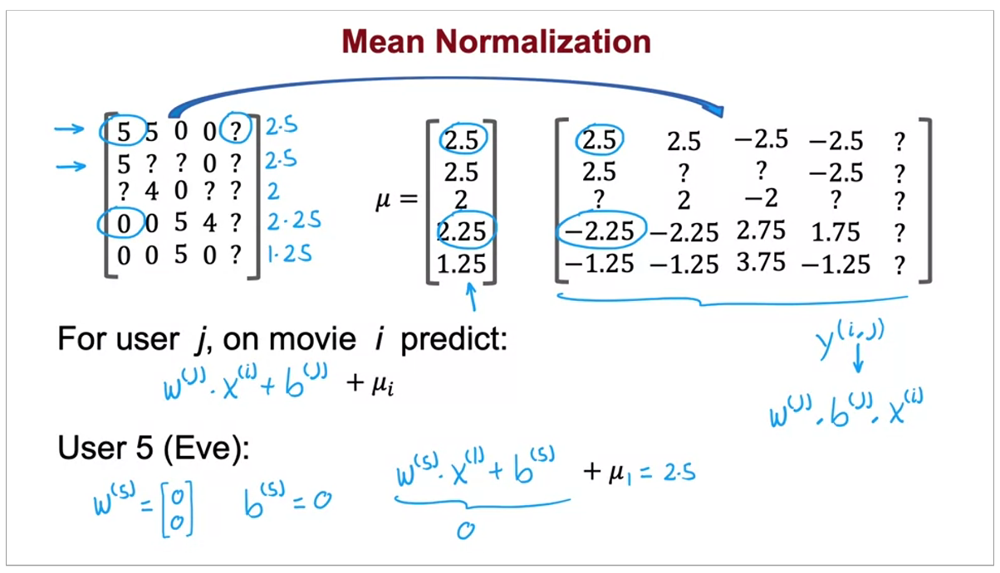
- Custom Function to calculate a derivatives
  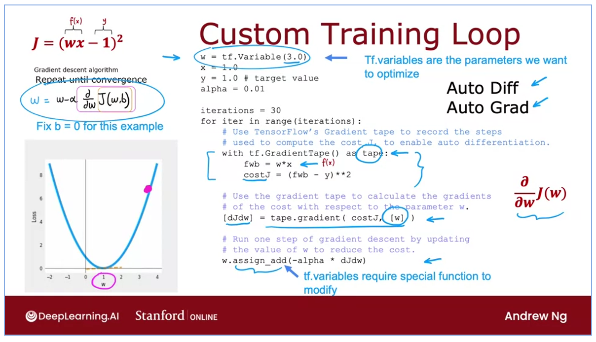
- With Adam
  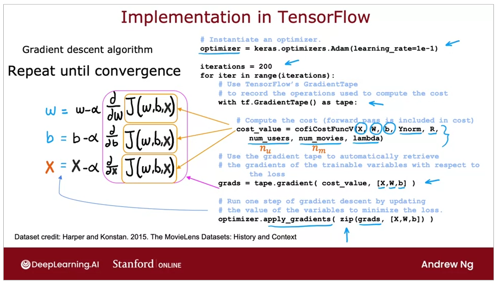
- We can't implement collaborative filtering with the mode.fit and predict so we need to implement the cost function ourselves.
- Collaborative filtering can be used to find related items such as movies, online shops, etc.
  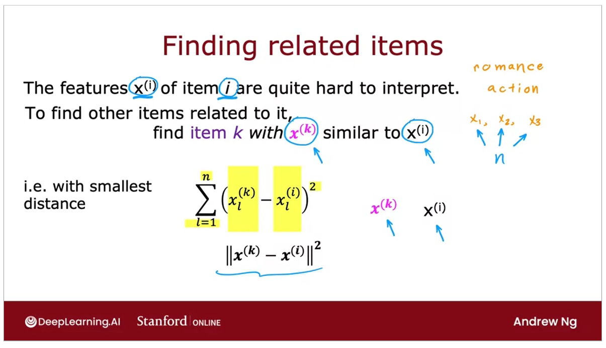
- Limitations of collaborative filtering
  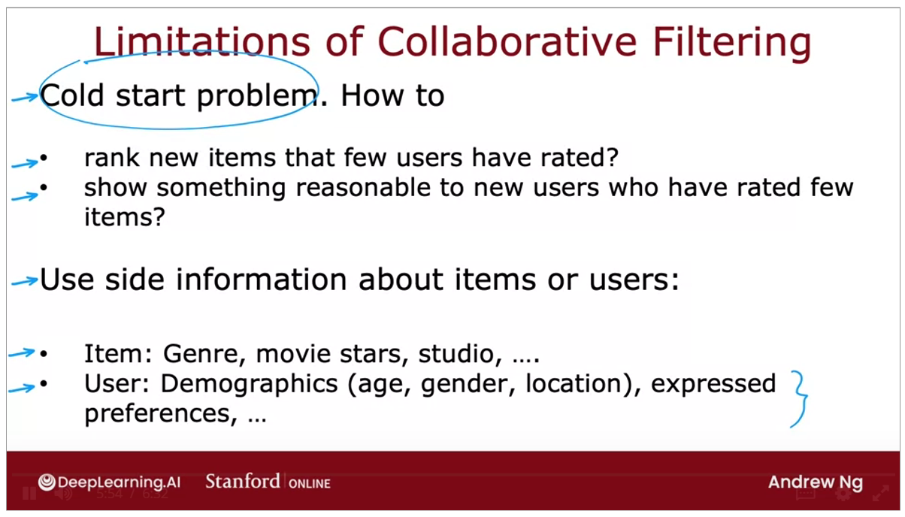 -> content based filtering exist to overcome this limitations

## Content-based filtering

- Content based vs Collaborative
  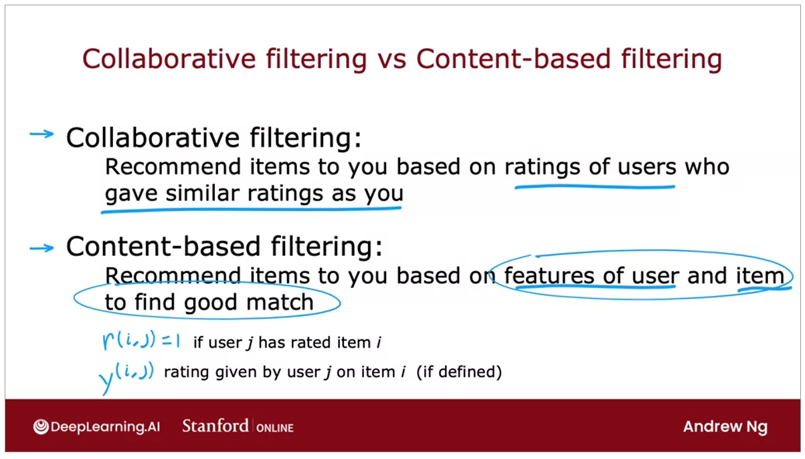
- Example of features
  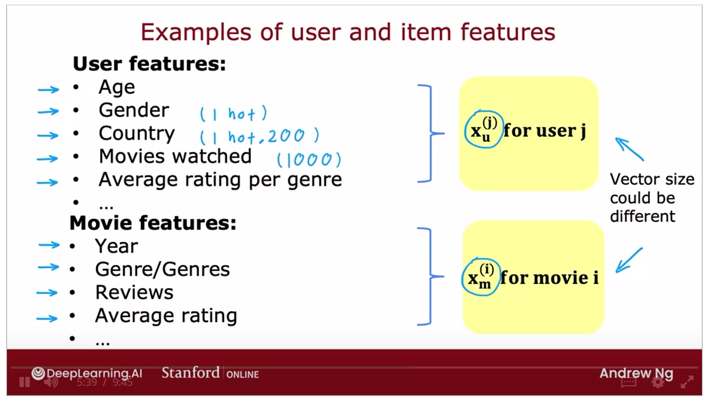
- Deep Learning for content-based filtering architecture
  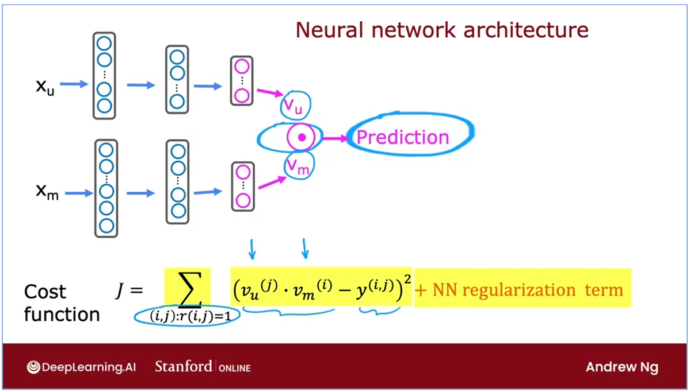
- How to efficiently find recommendations from a large sets of items?
  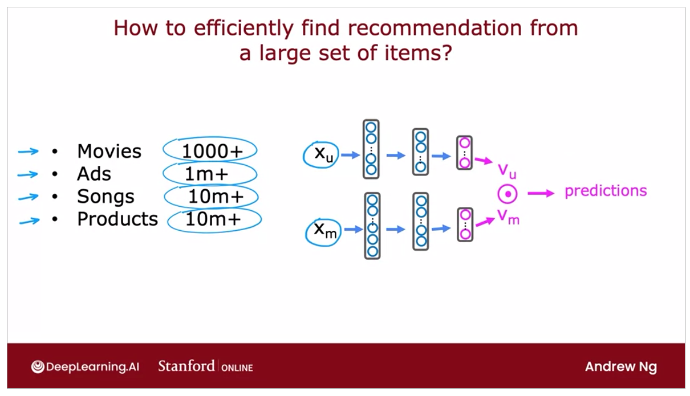
  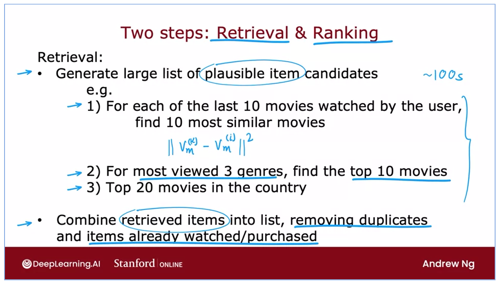
  - Retrieval step -> more items = better performance, slower recommendations. Analyze the trade off -> offline experiment to see if retrieving additional items results in more relevant recommendations ( y[i,j] = 1 ) (mungkin kek, sebanyak apa sih yang diklik sama si user?)
  - Ranking Step
    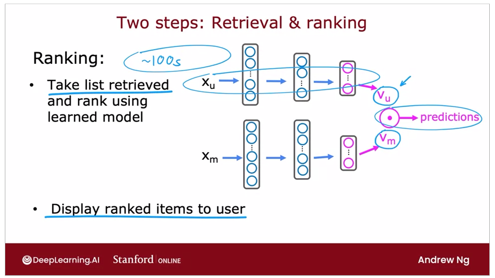
- The goal of the recommender system
  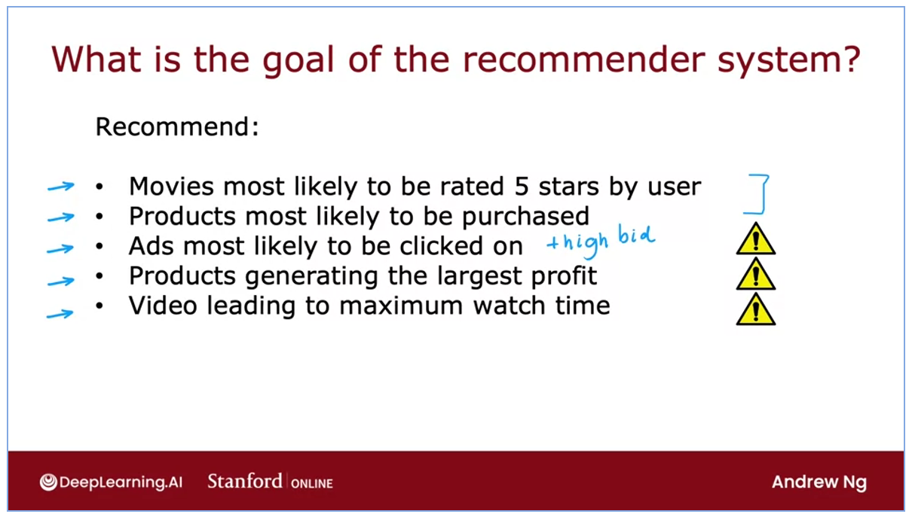
  - The problem is "how do we get to filter what the users consume if the content is toxic or bad"
- Implement content based filtering
  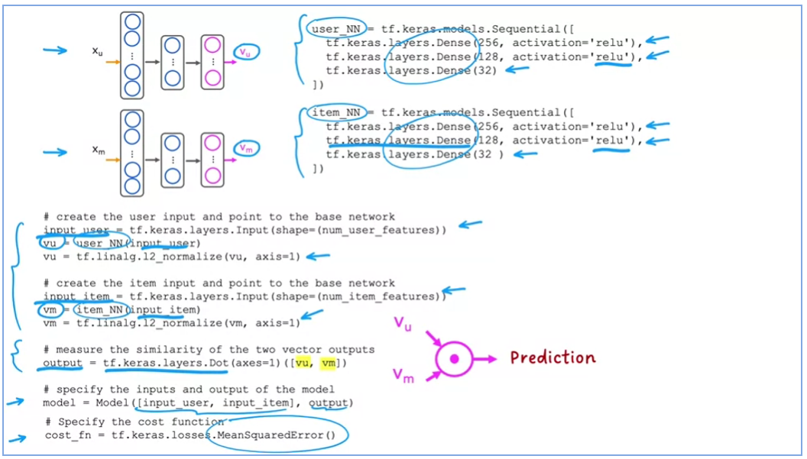
