# Decision Tree

## Decision Tree Introduction

## Decision Tree Learning

- Measuring purity -> entropy (garis melengkung parabola 0~1)
- Choosing a split: Information gain -> choosing a root node by choosing the highest **reduction in entropy** (ear shape as a root node):
  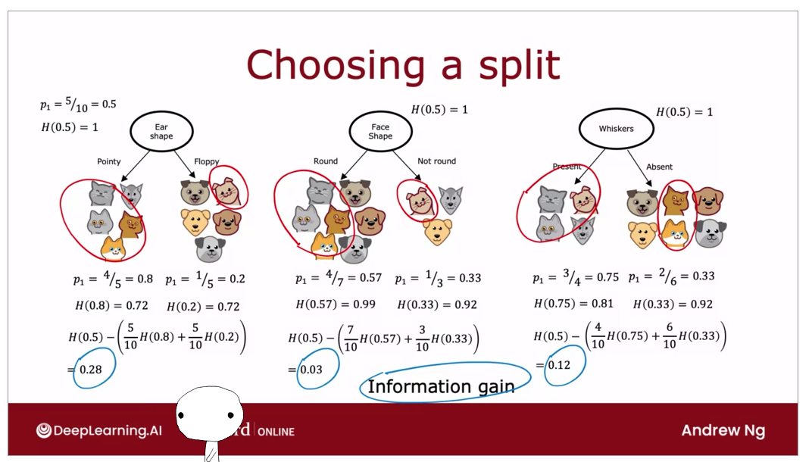
- Putting it together -> algorithm of decision tree:
  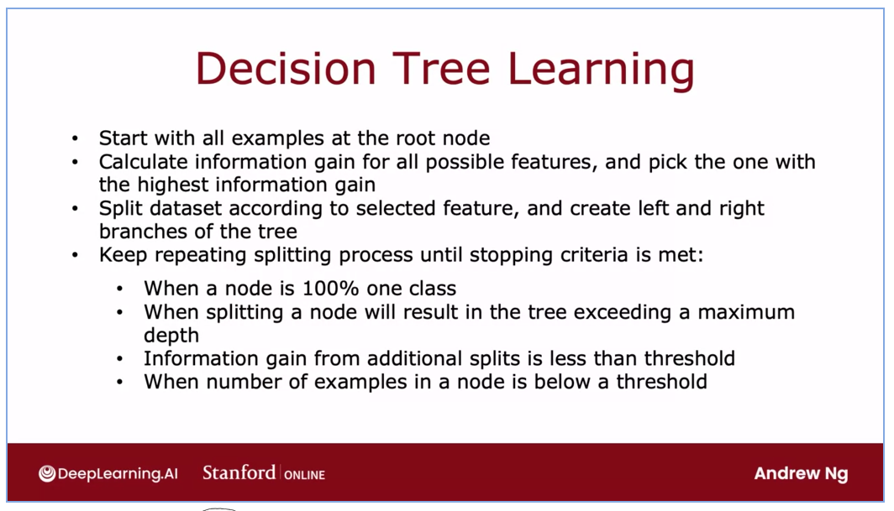
  - recursive implementation
  - the bigger the depth its like the polynomial features, may increase the risk of overfitting
- one-hot encoding of categorical featrues -> for example we have 3 categories of "ear shape" (pointy, oval, and floppy), then we need 3 sub-branches for the node. Instead, we can map the 3 categories into each features.
  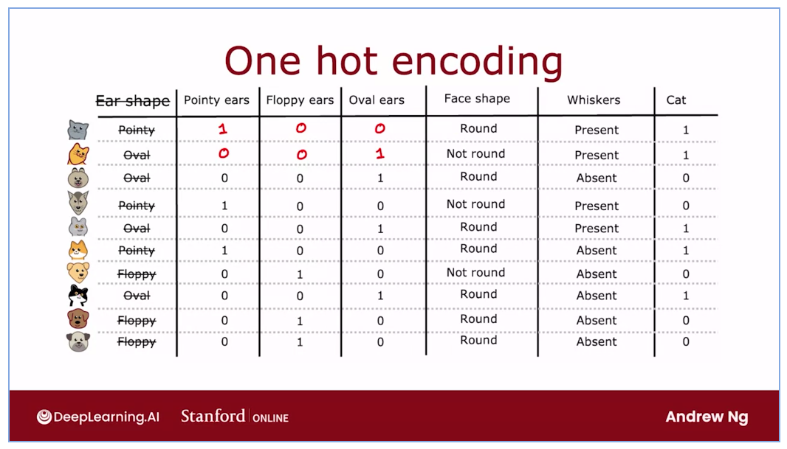
- splitting continuous value -> make a threshold, check the information gain
  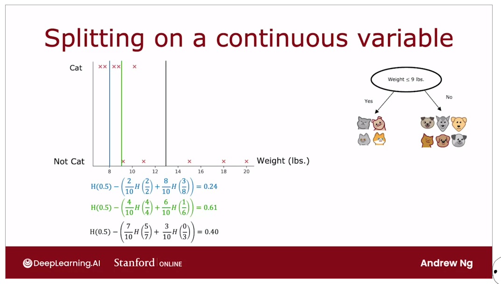
- regression trees (optional) -> predicting the weight
  - reduce the variance not the entropy
  - choosing the lowest (highest reduction in variance)
    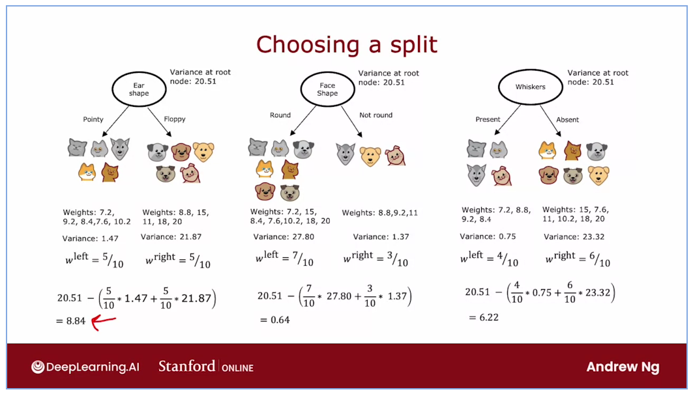

## Tree Ensembles

- Using multiple decision trees -> 1 subset change on the training data will change the whole sub-tree, that's' why we need multiple trees
  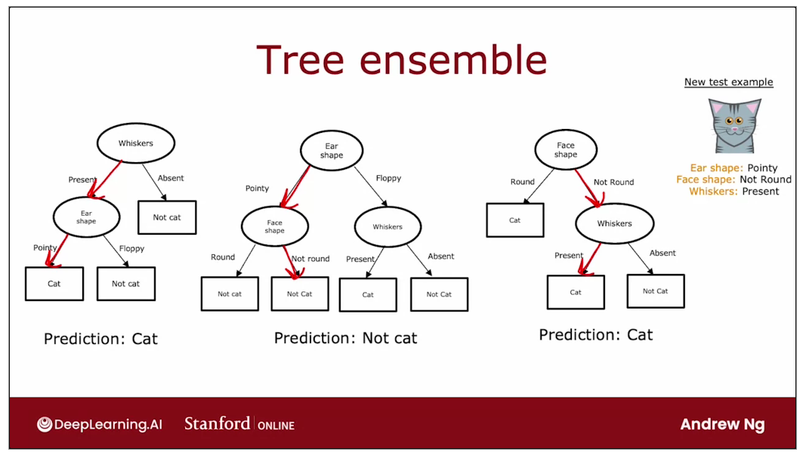
- sampling with replacement (statistic technique to build multiple trees) -> basically u have 4 inputs and u randomly take 1 input, record it, put it back in, and repeat
  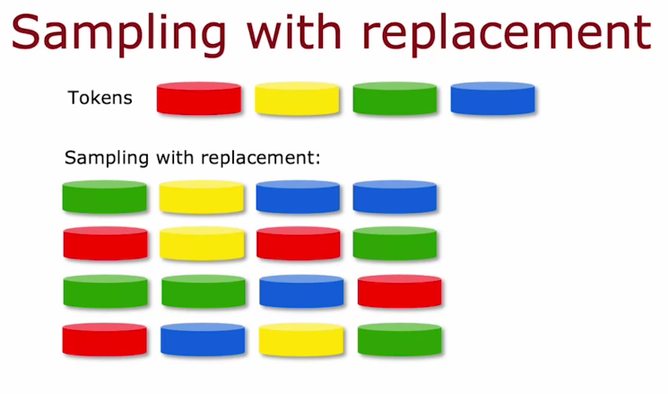
  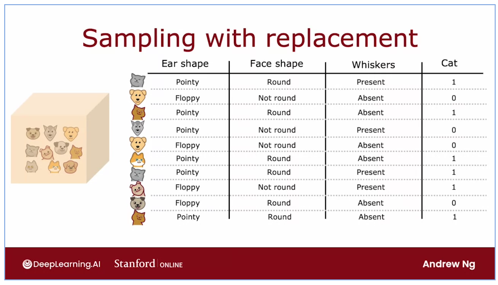
  -> create new training data based on the sampling-implementation
- random forest algorithm -> powerful tree ensemble algorithm -> basically, u do a sampling-replacement -> got the new training data -> create a tree, repeat until B (recommmend: 28~64).
  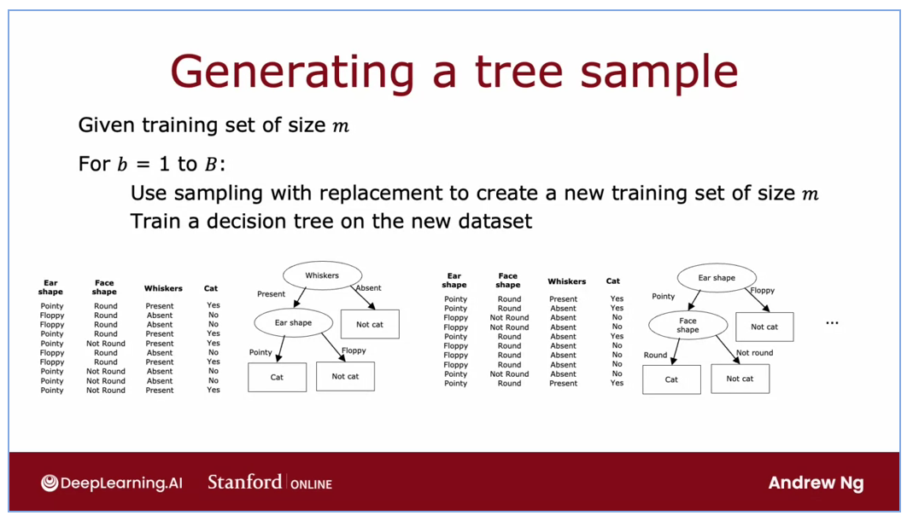
- XGBoost -> Boosting the previous algorithm, most ppl use the open source library of XGBoost
  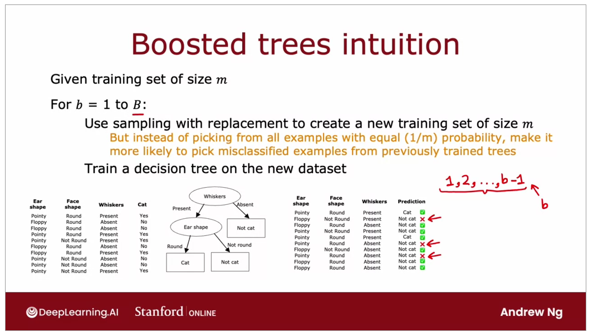
- When to use Decision Trees:
  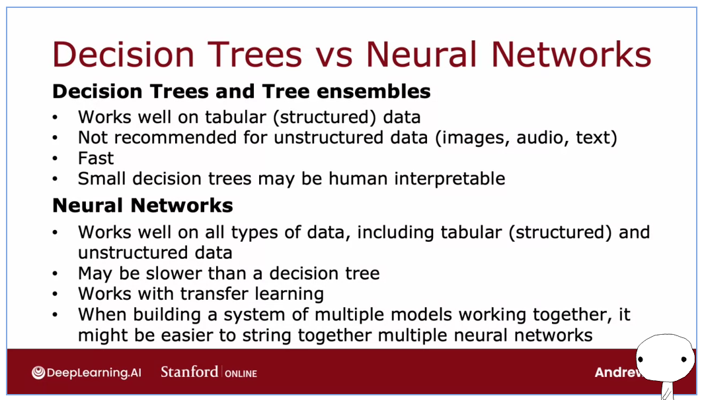
