# Reinforcement Learning

## Introduction

- Applications
  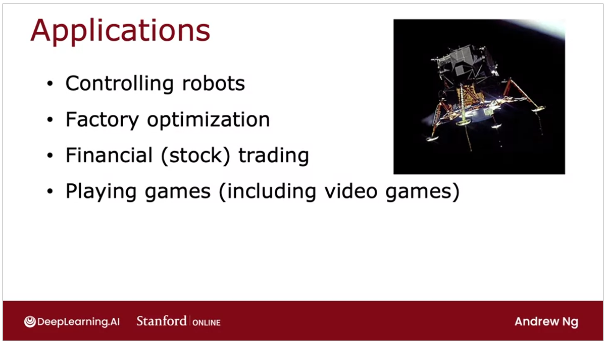
- The return -> rewards that you can get quicker instead taking the path into the long one
  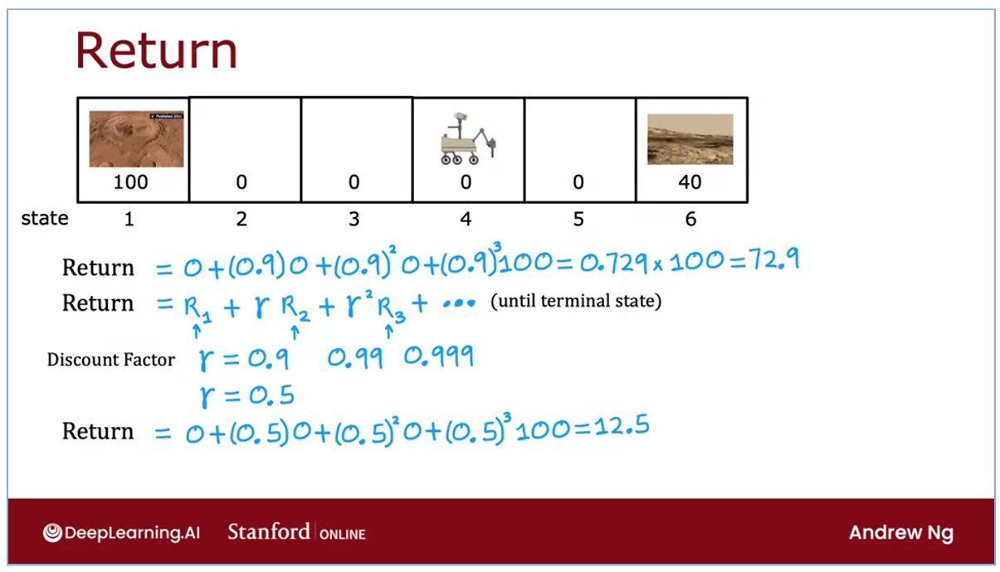
- Discounnt Factor -> how much less a dollar in the future worth compare to a dollar today
- Policy
  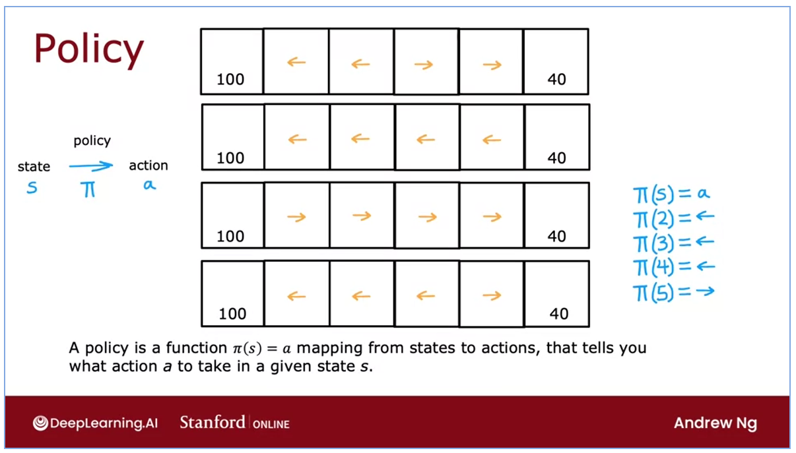
- The goal of reinforcement is to find the policies
- key concepts
  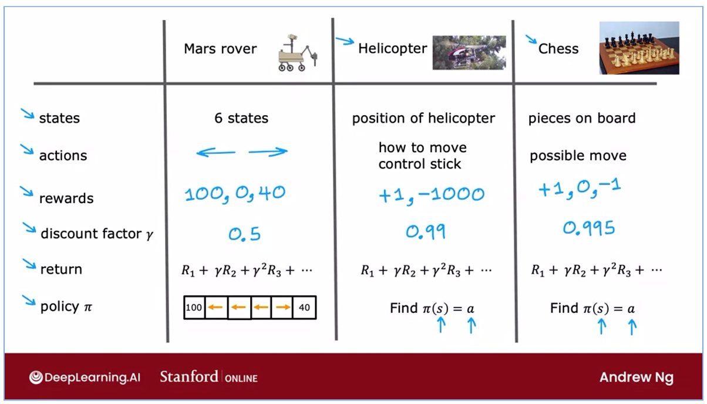
- Markov Decision Process
  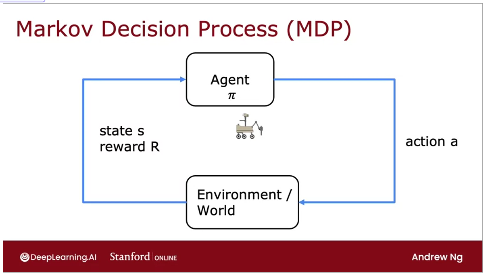

## State-action value function

- Picking Actions
  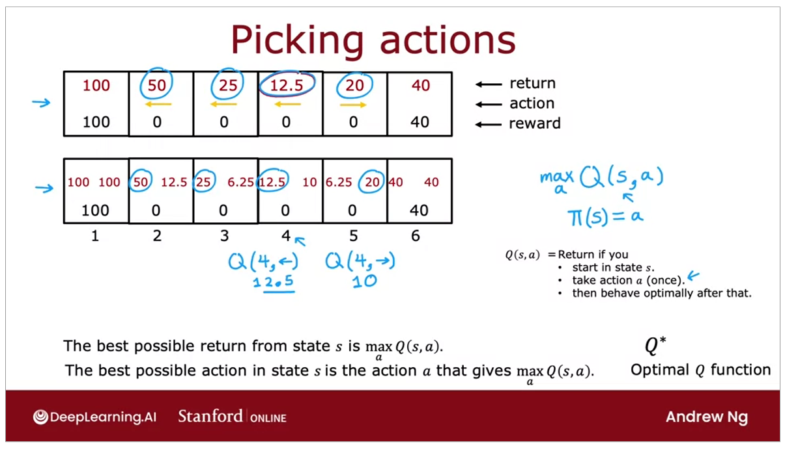
- State-action value function -> discount factor closer to 1 = more patient to achieve the higher reward
- Bellman Equation
  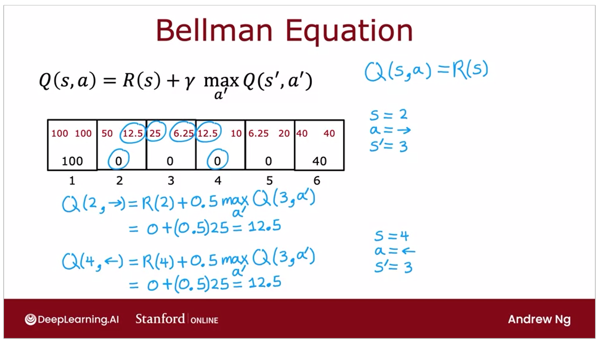
  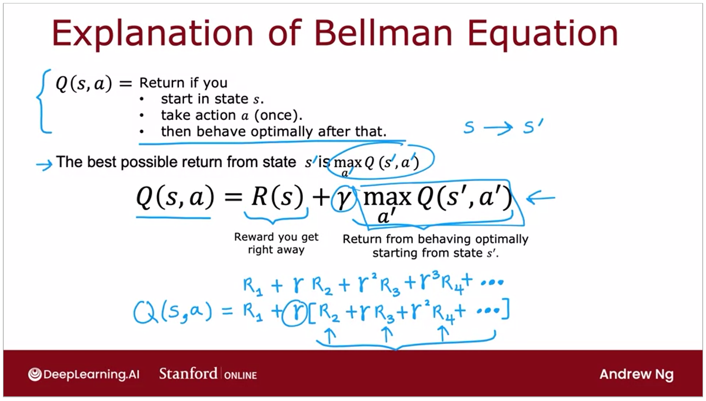

## Continuous State Spaces

- Reward Function Lunar Lander Problem
  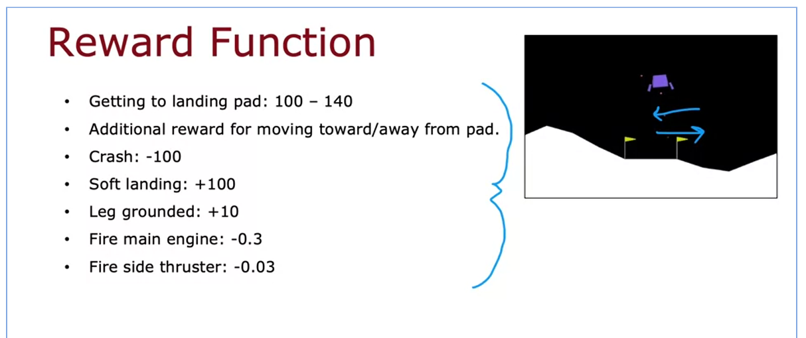
- Deep Reinforcement Learning
  - Architecture
    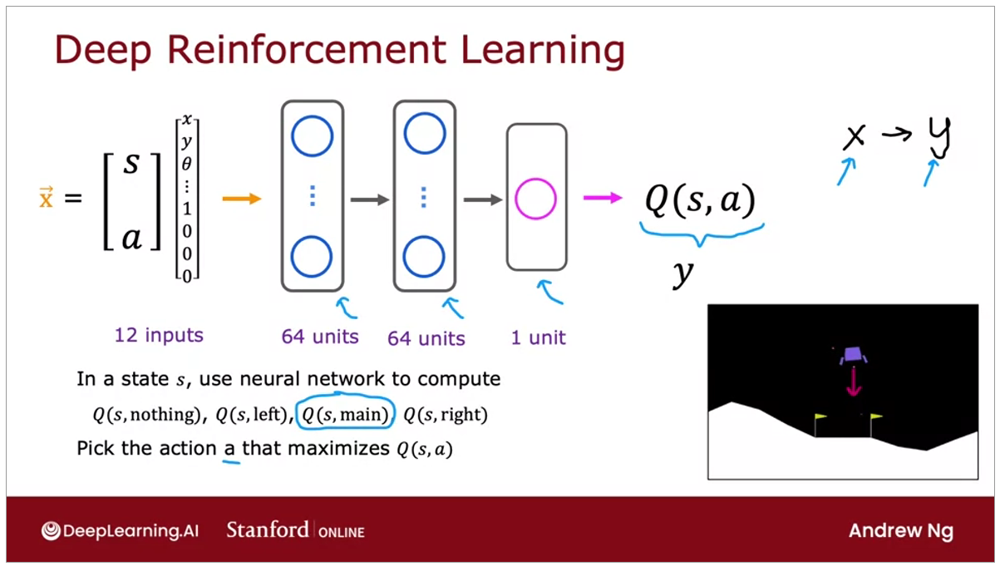
  - Learning Algorithm (DQN) -> (Deep-Q Network)
    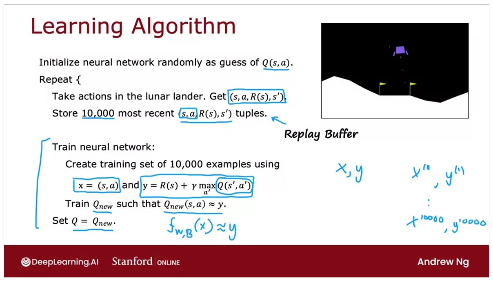
- Refining the Algorithm
  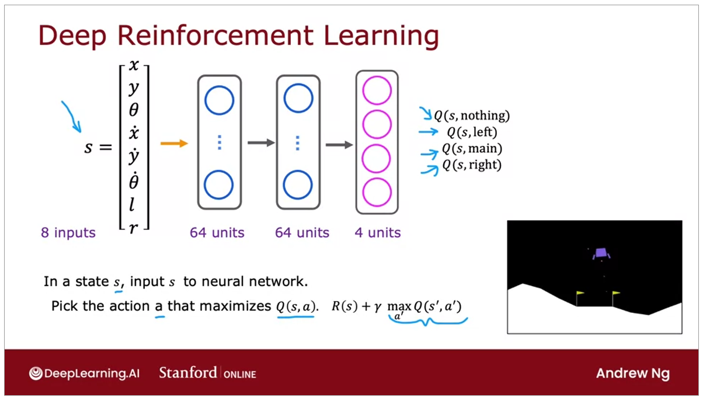
- Epsilon Greedy Policy -> choose action while learning
  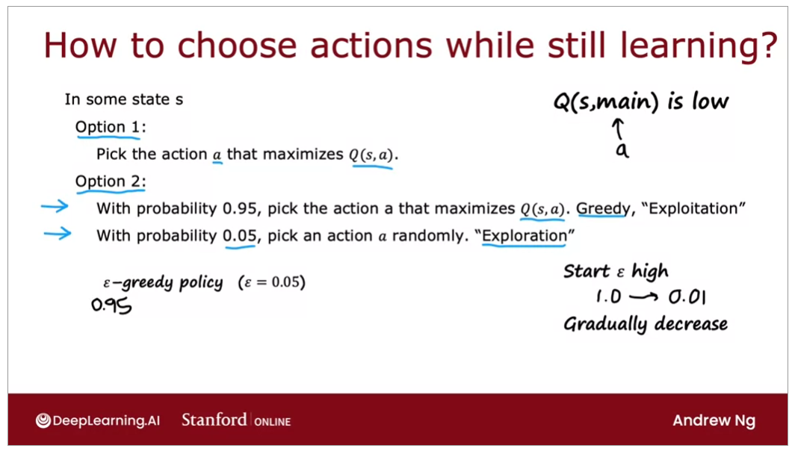
- Mini-batch -> if u have 100.000.000 training dataset, is too much to compute, then u split it into a 1000 each.
  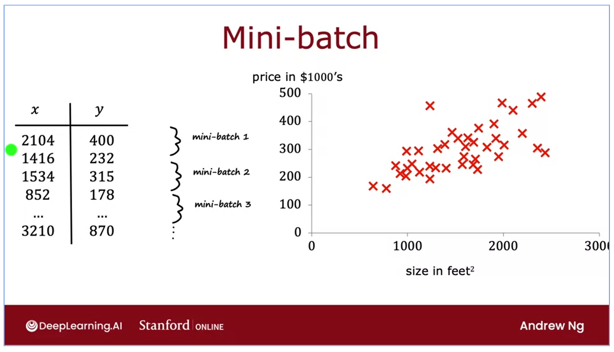
  Mini batch with Adam is more useable in the practical
  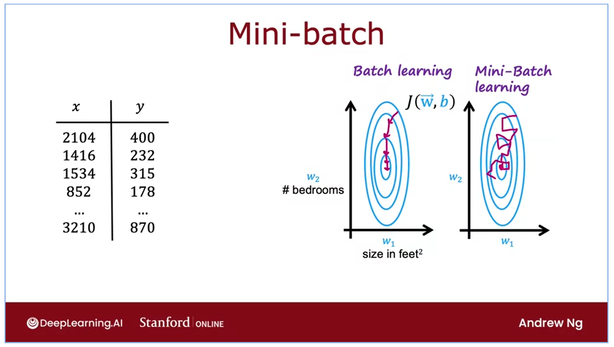
  Mini batch in reinforcement
  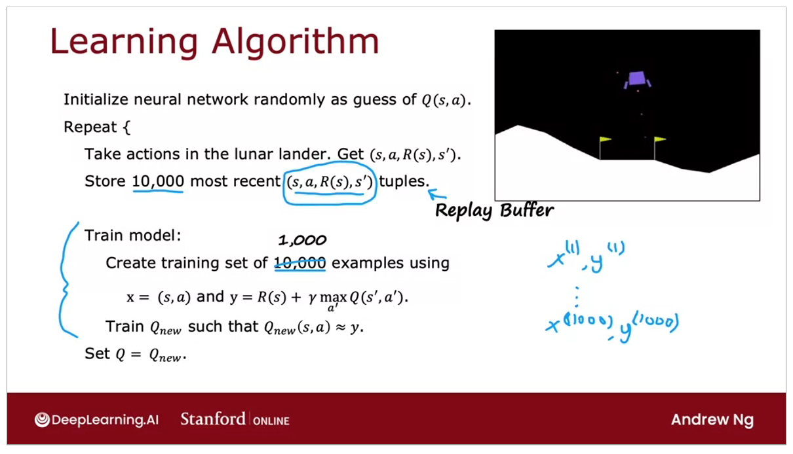
- Soft update is to prevent the update on the Q to Qnew without overwriting it
  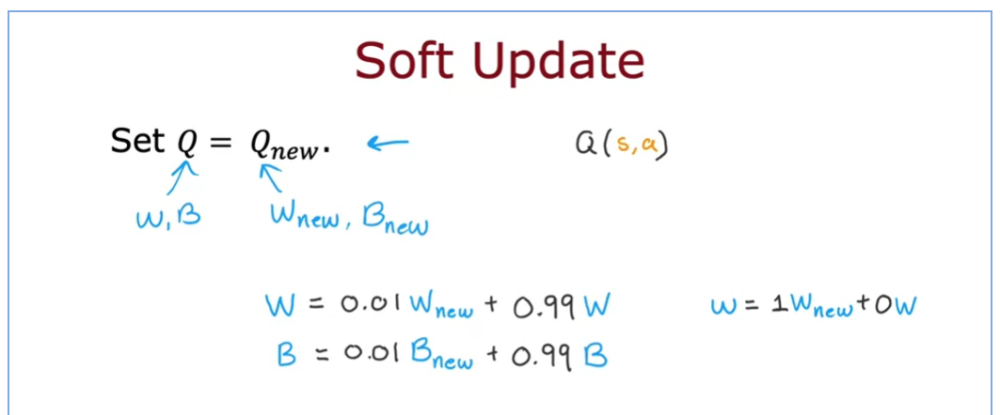
- Limitations with Reinforcement Learning
  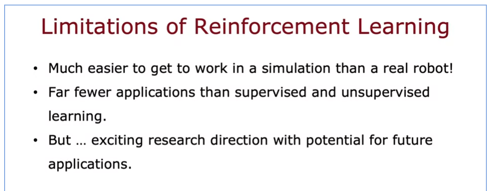

## Summary

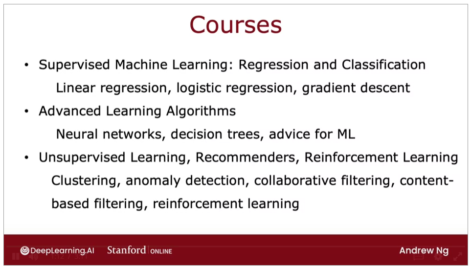
