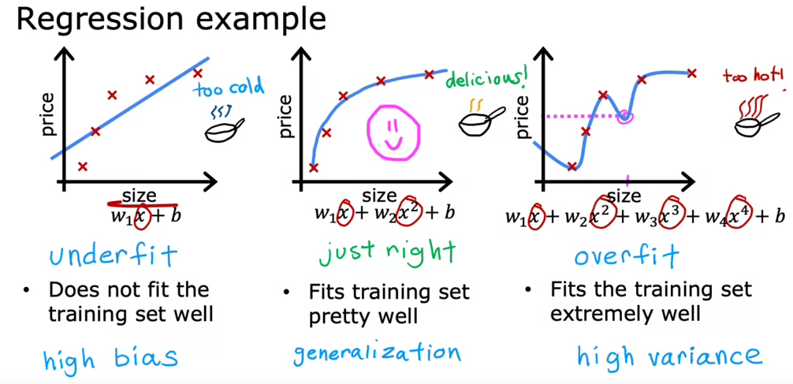
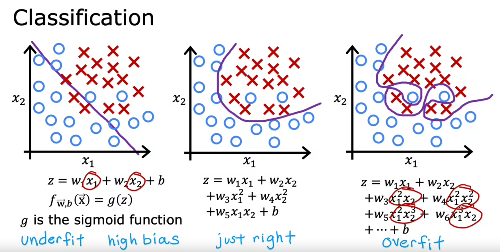

# Addressing overfitting

1. Collect more data
2. Select Features
   1. Feature Selection (in course 2) -> basically automaticly select the most relevant/useful featues for the model
3. Reduce size of paramters
   1. Regularization
