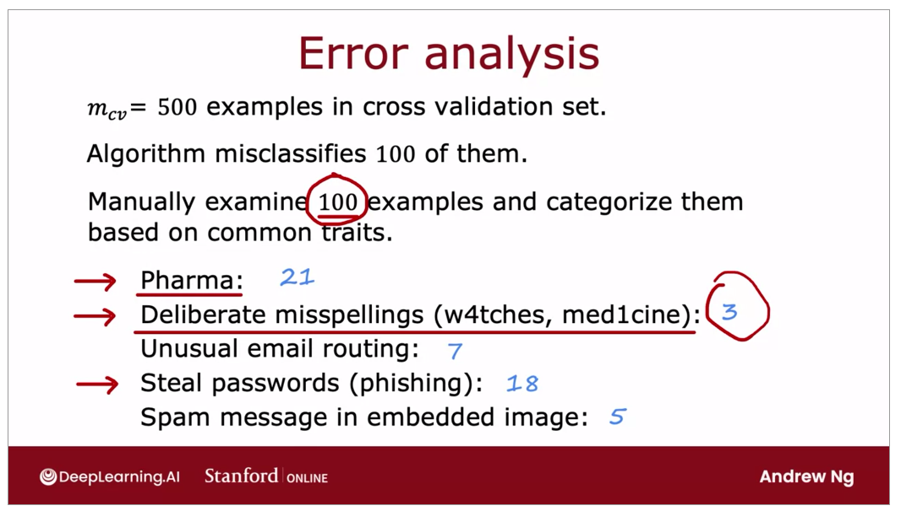
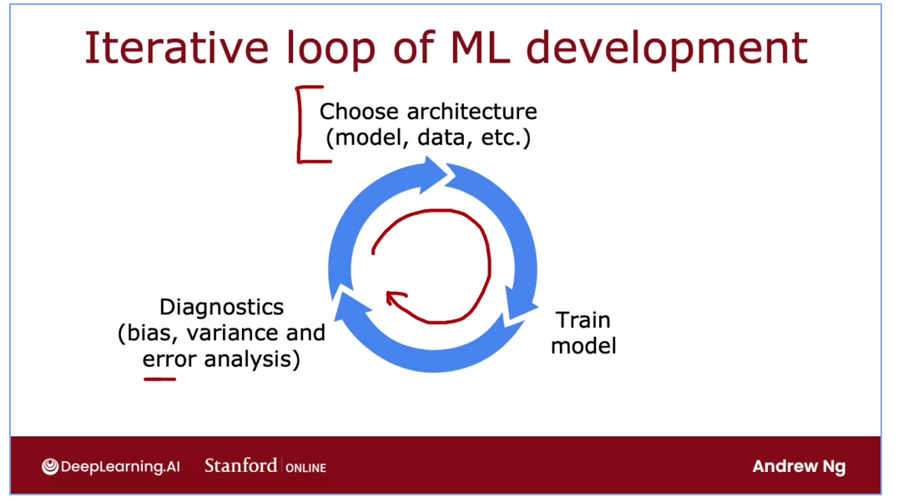
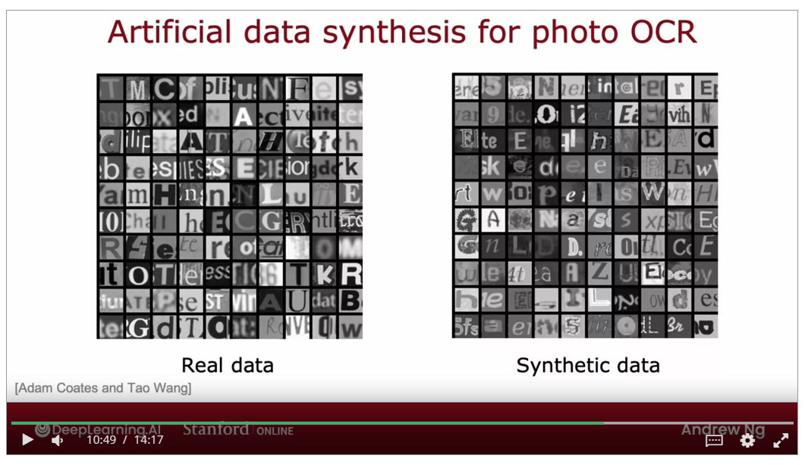
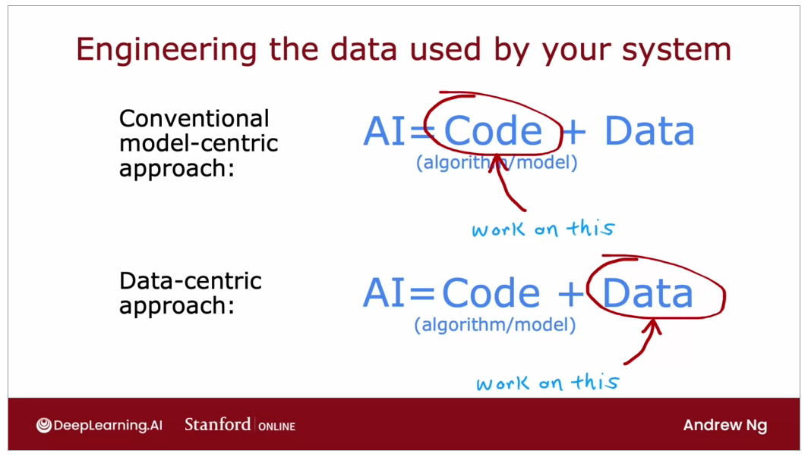
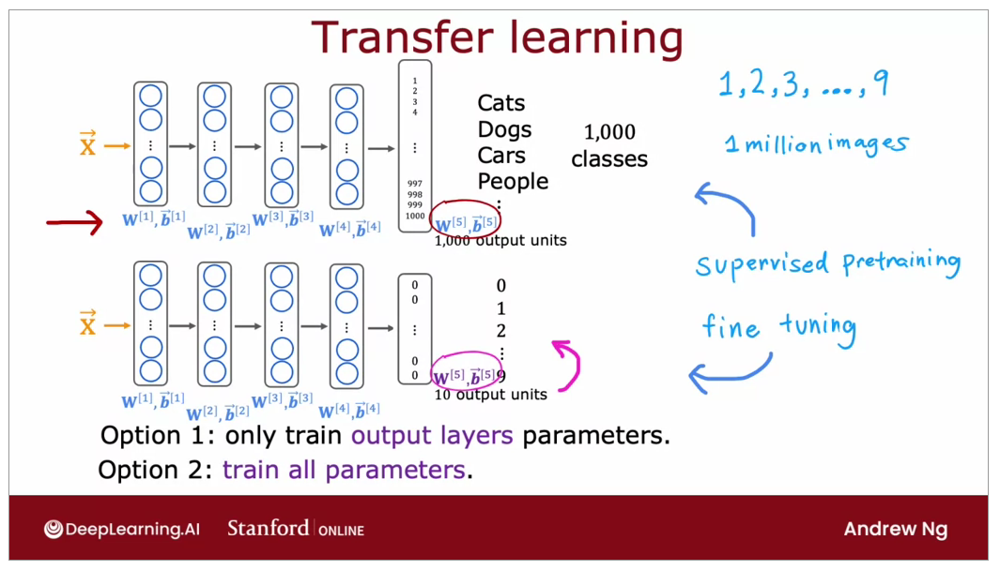
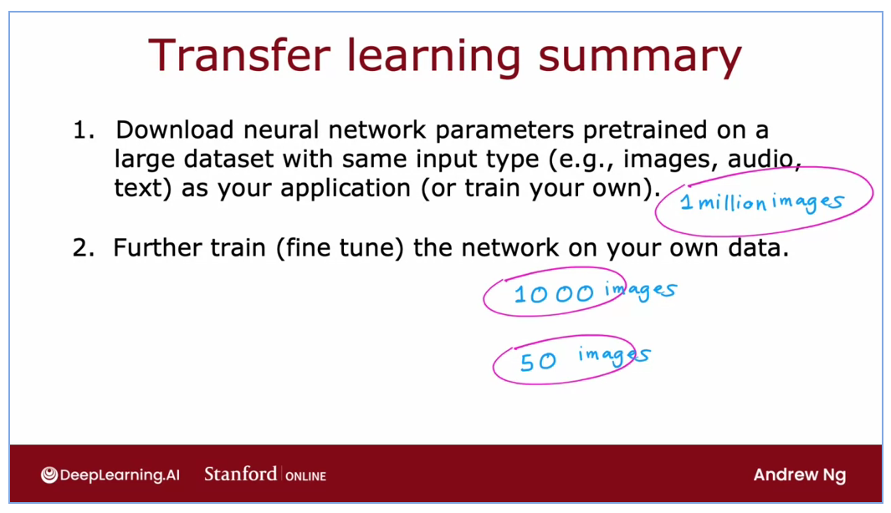
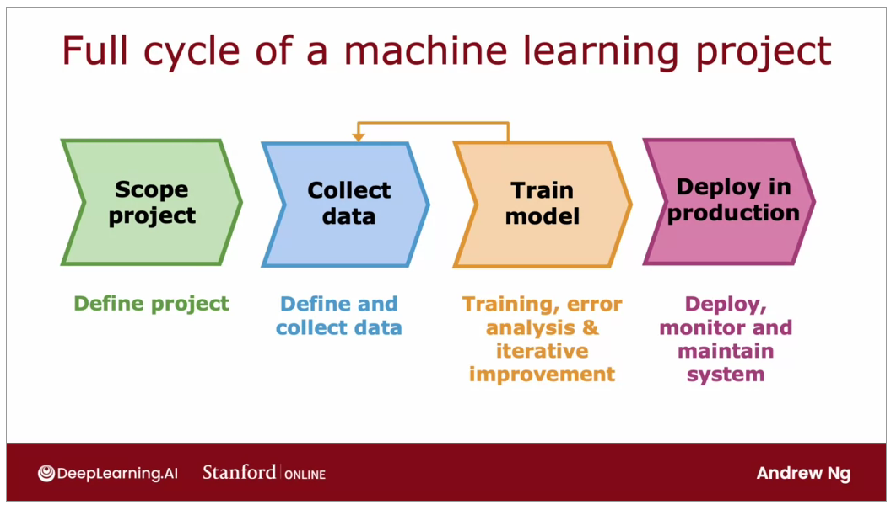

# Machine Learning Dev

- try to group them by "what's wrong with the missclasified output"
- we are doing this to find insights
- find inspiration -> collect more data specifically on the missclasified output

Iterative loop of ML Dev:

Adding data:

- Data Augmentation
- Speech Recognition -> add background noise (crowd, car)
- Data Synthesis -> making artificial data

We can actually focus on the data-centric approach to increase the performance of the machine learning

Transfer learning:

## Full Cycle

